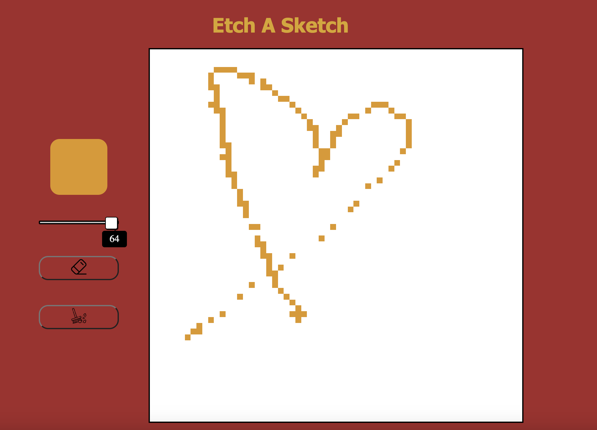

# Etch-A-Sketch
this is a simple etch-a-sketch program that allows you to draw on a grid using your mouse.

## Screenshot

## How to use

Click the link below to open the program in your browser.
[Etch-A-Sketch](https://mosmn.github.io/Etch-A-Sketch/)

## Technologies used

- HTML
- CSS
- JavaScript
(no frameworks or libraries)

## Approach

I started by creating the grid using JavaScript. I created a function that creates a div for each cell in the grid. I then added an event listener to each cell that changes the background color to black when the mouse hovers over it. I then added a button that clears the grid and prompts the user to enter a new grid size. I then added a button that changes the background color of the cells to a random color when clicked and hovered over at the same time, and a eraser button that changes the background color of the cells back to white when clicked and hovered over at the same time. finally, I added a button that clears the grid entirely.

## Challenges

The biggest challenge I faced was creating the grid. I had to use a lot of trial and error to get the grid to work properly, because i had to make sure that the grid was responsive and that the cells were the same size without using CSS grid so i had to use JavaScript to calculate the size of the cells. I also had to use a lot of trial and error to get the buttons to work properly.

## Future features

- Add a rainbow button that allows the user to draw with a rainbow color.

